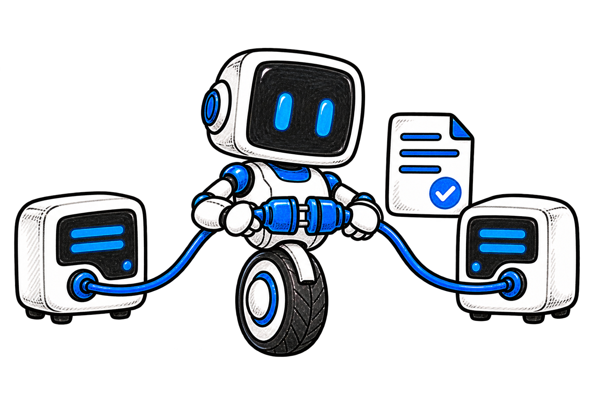
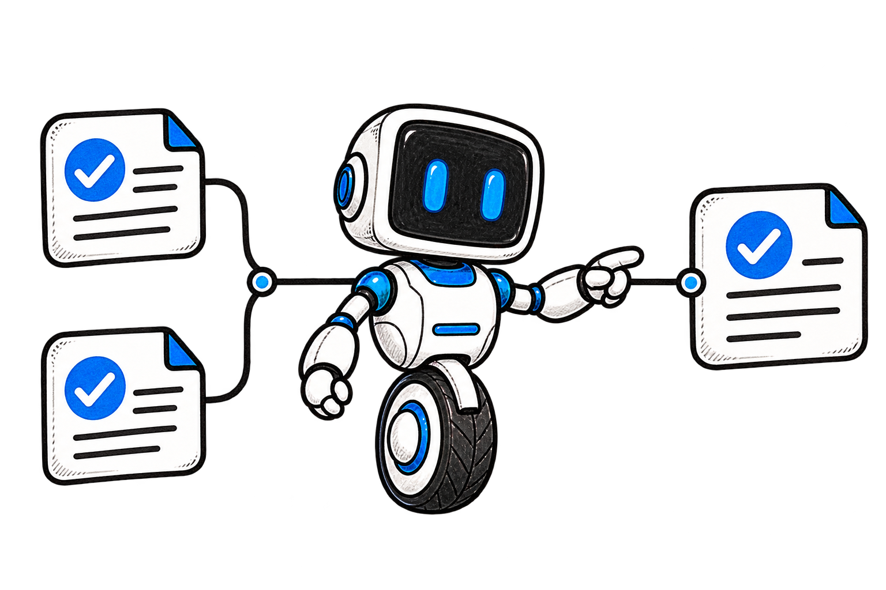
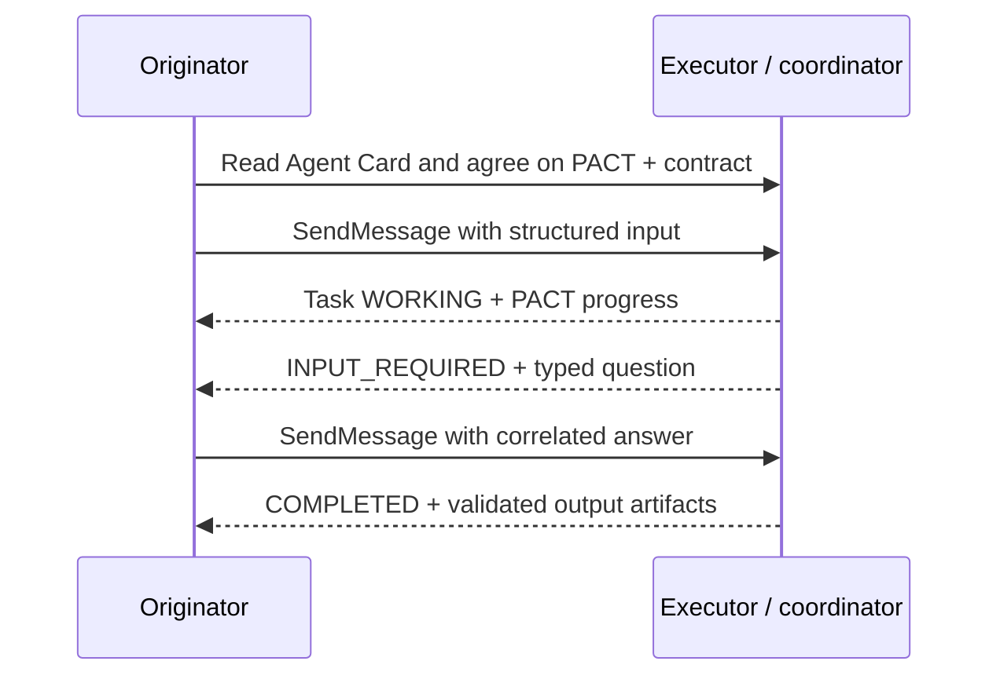

<p align="center">
  
</p>

<p align="center">
  
</p>

<h1 align="center">PACT</h1>

<p align="center"><strong>Protocol for Agent Coordination and Tasks</strong></p>

<p align="center">Explicit contracts, structured questions, measurable progress, and accountable swarm coordination over A2A.</p>

**Draft v0.1.0 · Independent A2A profile proposal · MIT**

PACT describes how independently built agents can agree on task inputs and outputs, ask typed questions, report work, and coordinate a dependency graph of contributors. It uses A2A discovery, messages, tasks, artifacts, and extension negotiation. The native A2A task status remains authoritative.

This repository contains a reviewable specification, JSON Schemas, A2A 1.0 examples, and an offline conformance toolkit. Live transport adapters and reference SDKs are [planned](docs/roadmap.md). PACT is an independent proposal without official A2A endorsement. Its `example.org` extension URI is a placeholder pending a permanent project identity.

## Try the draft

Use **Node.js 22 or newer**. From this checkout:

```sh
npm ci --ignore-scripts
npm run check
npm run validate -- progress examples/progress.json
```

The suite should report **88/88 conformance checks passed**, followed by repository integrity checks. The last command confirms that the sample progress satisfies both its JSON Schema and arithmetic rules. After installation, all validation runs locally without fetching schemas or contacting agents.

Start with the [specification](specification/PACT-SPEC-v0.1.md) and [wire conventions](specification/wire-conventions.md), then follow the [annotated two-agent flow](examples/README.md).

## Agree on data before doing work


A contract fixes an ID, semantic version, and exact-byte SHA-256 digest for each input and output schema. Optional answer schemas constrain clarification. The receiver verifies the declared schema before validating the payload; an unknown field is rejected when the schema forbids it.

PACT adds five resources under the negotiated extension URI in A2A metadata:

| Resource | What it establishes |
| --- | --- |
| Contract | The exact accepted input and required output shapes |
| Question / answer | Which task needs input, what values are allowed, and which question an answer resolves |
| Progress | Stage, ordered sequence, measured units, and a checked percentage |
| Event | Producer identity, correlation, replay detection, and ordering |
| Swarm | Child dependencies, aggregation policy, validation verdicts, and contributor provenance |

The [13 resource schemas](specification/schemas/) use JSON Schema Draft 2020-12. Cross-field arithmetic, ordering, lifecycle, and DAG checks are documented separately because JSON Schema cannot express all of them.

## Coordinate through A2A



The originator reads an Agent Card, negotiates the PACT version and exact contract, then sends a native A2A message with structured data. The executor reports work, requests additional input when necessary, and returns validated artifacts.



For a swarm, one coordinator owns the parent task and schedules children after their dependencies succeed. `all_required` gates success on every required child; `quorum` counts valid successful outputs from an explicitly eligible set. Parent output validation still gates completion. The [swarm example](examples/swarm.json) retains an optional child failure without blocking the required work.

## Completion carries evidence


Progress at 100% does not complete a task. HTTP success does not complete a task. A native A2A `COMPLETED` outcome requires validated output artifacts and finished aggregation where applicable.

The conformance corpus tests strict shapes, arithmetic, negotiation, question deadlines, immutable terminal states, duplicate/conflicting commands and events, stale delivery, simulated receipt restoration, DAG dependencies, and aggregation boundaries. Its JSON fixtures and scenario expectations can be consumed by implementations in other languages.

```sh
# Run the portable corpus
npm run conformance

# Emit a machine-readable result without npm's command banner
node tools/conformance.mjs --json

# Check a resource; invalid input returns a nonzero exit code
npm run validate -- swarm examples/swarm.json
```

See the [conformance guide](conformance/README.md) for scope and the [CLI reference](docs/tooling.md) for commands and error codes. In-memory receipt models demonstrate protocol rules; production adapters need durable atomic storage and authenticated tenant/delegation checks. The toolkit does not certify full A2A conformance or production security.

## Find your next file

| Path | Purpose |
| --- | --- |
| [specification/](specification/README.md) | Original proposal, executable draft conventions, vocabulary, schemas |
| [examples/](examples/README.md) | Local contract registry, exact digests, A2A envelopes, swarm data |
| [conformance/](conformance/README.md) | Portable positive/negative resources and behavior scenarios |
| [tools/](docs/tooling.md) | Offline validators, semantic models, repository checks |
| [docs/compatibility.md](docs/compatibility.md) | Reviewed A2A binding and verification limits |
| [docs/roadmap.md](docs/roadmap.md) | Delivered work, open decisions, and release requirements |

## Contribute

Read [CONTRIBUTING](CONTRIBUTING.md), [governance](GOVERNANCE.md), and the [code of conduct](CODE_OF_CONDUCT.md). Protocol changes should bring normative text, schemas, examples, and both passing and failing fixtures. Security reports follow the [security policy](SECURITY.md).

PACT retains the repository's [MIT license](LICENSE.md). The source proposal's Apache-2.0 suggestion remains a governance decision for review.

The upstream foundation is the [A2A protocol](https://github.com/a2aproject/A2A), specifically the [v1.0.1 models](https://github.com/a2aproject/A2A/blob/v1.0.1/specification/a2a.proto) and [extension guidance](https://github.com/a2aproject/A2A/blob/v1.0.1/docs/topics/extensions.md). PACT's transport and native lifecycle follow that protocol.
