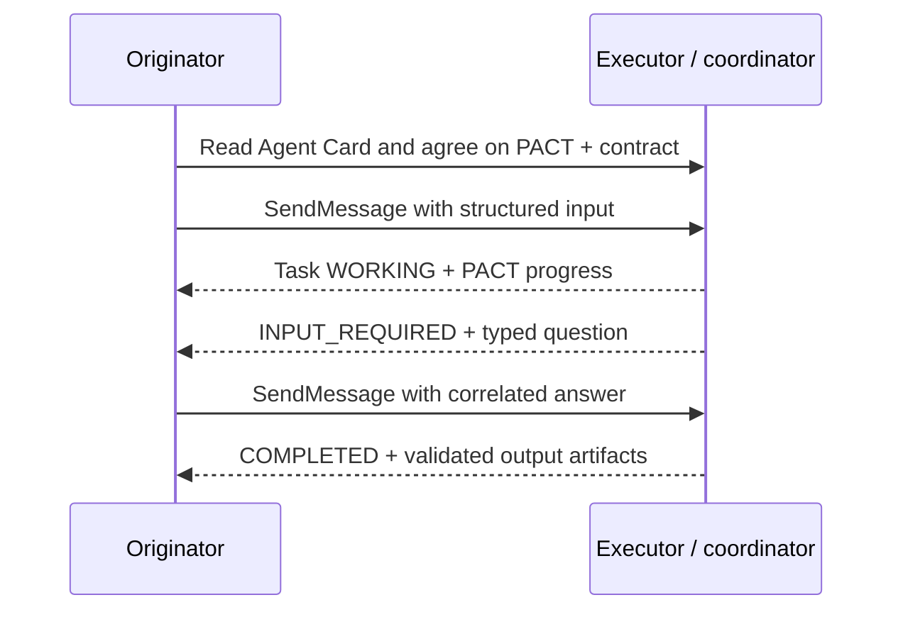

<p align="center">
  
</p>

<p align="center">
  
</p>

<h1 align="center">PACT</h1>

<p align="center"><strong>Protocol for Agent Coordination and Tasks</strong></p>

<p align="center">Explicit contracts, structured questions, measurable progress, and accountable swarm coordination over A2A.</p>

**Draft v0.2.0 · Independent A2A profile proposal · MIT**

PACT describes how independently built agents can agree on task inputs and outputs, ask typed questions, report work, and coordinate a dependency graph of contributors. It uses A2A discovery, messages, tasks, artifacts, and extension negotiation. The native A2A task status remains authoritative.

This repository contains normative Core and optional Swarm profiles, independent TypeScript and PHP SDKs, a Laravel routing adapter, a durable three-contributor HTTP demo, and portable/live conformance tests. PACT is an independent proposal without official A2A endorsement. Project-controlled identifiers replace the archived `example.org` placeholders; publishing them remains the owner's release step.

## Try the draft

Use Node.js 22+, PHP 8.2+ and Composer 2. From this checkout:

```sh
npm ci --ignore-scripts
npm run build:sdk
composer install --working-dir=sdk/php --no-interaction
composer install --working-dir=reference --no-interaction
php reference/bin/setup.php
npm run check
node examples/v0.2/demo.mjs
```

The demo runs on Herd at **http://pact.test**. It receives two typed questions, answers them, and independently validates the PHP/Laravel artifact. For the three-contributor demo, run `php reference/bin/worker.php --watch` in another terminal, then `npm run demo:swarm`.

[Quickstart](docs/quickstart.md) explains private local configuration and worker operation. `npm run docs:build` builds navigable documentation at **http://pact.test/docs/**. No model API key is needed.

Start with [Core v0.2](specification/PACT-CORE-v0.2.md), [optional Swarm](specification/PACT-SWARM-v0.2.md), and the [SDK guides](sdk/typescript/README.md). The supplied [v0.1 proposal](specification/PACT-SPEC-v0.1.md) remains an archived source record.

## Agree on data before doing work


A contract fixes an ID, semantic version, and exact-byte SHA-256 digest for each input and output schema. Optional answer schemas constrain clarification. The receiver verifies the declared schema before validating the payload; an unknown field is rejected when the schema forbids it.

PACT adds five resources under the negotiated extension URI in A2A metadata:

| Resource | What it establishes |
| --- | --- |
| Contract | The exact accepted input and required output shapes |
| Question / answer | Which task needs input, what values are allowed, and which question an answer resolves |
| Progress | Stage, ordered sequence, measured units, and a checked percentage |
| Event | Producer identity, correlation, replay detection, and ordering |
| Swarm | Child dependencies, aggregation policy, validation verdicts, and contributor provenance |

The [versioned v0.2 schemas](specification/0.2/schemas/) use JSON Schema Draft 2020-12. Cross-field arithmetic, ordering, lifecycle, and DAG checks are documented separately because JSON Schema cannot express all of them.

## Coordinate through A2A


The originator reads an Agent Card, negotiates the PACT version and exact contract, then sends a native A2A message with structured data. The executor reports work, requests additional input when necessary, and returns validated artifacts.



For a swarm, one coordinator owns the parent task and schedules children after their dependencies succeed. `all_required` gates success on every required child; `quorum` counts valid successful outputs from an explicitly eligible set. Parent output validation still gates completion. The [live swarm demo](examples/v0.2/demo.mjs) records an optional audit failure and a review retry while three required collaborators produce the result. Fixed execution/aggregation/validation weights show current effort and retain a separate historical maximum.

## Completion carries evidence


Progress at 100% does not complete a task. HTTP success does not complete a task. A native A2A `COMPLETED` outcome requires validated output artifacts and finished aggregation where applicable.

The shared v0.2 vectors compare independent implementations against expected results. The legacy corpus retains its original 88 checks. Live tests exercise negotiation, concurrent answers, tenant isolation, cancellation, conflicting/duplicate/stale events, dropped responses, bounded retries and a real coordinator process kill/restart.

```sh
node tools/pact.mjs test http://pact.test/a2a \
  --config storage/demo-config.json --reference-suite
npm run test:integration
```

A broken peer is rejected for invalid output or missing activation. SQLite commits acceptance, questions, task state and outbox together; the crash test verifies that replay returns the committed child task without a second effect. See [conformance](conformance/v0.2/README.md) and [implementation limits](docs/implementation.md). This suite does not certify every A2A feature or production operation.

## Find your next file

| Path | Purpose |
| --- | --- |
| [specification/](specification/README.md) | Normative Core/Swarm, archived proposal and schemas |
| [examples/](examples/README.md) | Pinned registries, exact digests and executable HTTP demos |
| [conformance/](conformance/README.md) | Shared independent vectors, legacy fixtures and HTTP faults |
| [tools/](docs/tooling.md) | Offline validation, live peer CLI, SDK/docs builds |
| [docs/compatibility.md](docs/compatibility.md) | Reviewed A2A binding and verification limits |
| [docs/roadmap.md](docs/roadmap.md) | Delivered work, open decisions, and release requirements |

## Contribute

Read [CONTRIBUTING](CONTRIBUTING.md), [governance](GOVERNANCE.md), and the [code of conduct](CODE_OF_CONDUCT.md). Protocol changes should bring normative text, schemas, examples, and both passing and failing fixtures. Security reports follow the [security policy](SECURITY.md).

PACT retains the repository's [MIT license](LICENSE.md). The source proposal's Apache-2.0 suggestion remains a governance decision for review.

The upstream foundation is the [A2A protocol](https://github.com/a2aproject/A2A), specifically the [v1.0.1 models](https://github.com/a2aproject/A2A/blob/v1.0.1/specification/a2a.proto) and [extension guidance](https://github.com/a2aproject/A2A/blob/v1.0.1/docs/topics/extensions.md). PACT's transport and native lifecycle follow that protocol.
