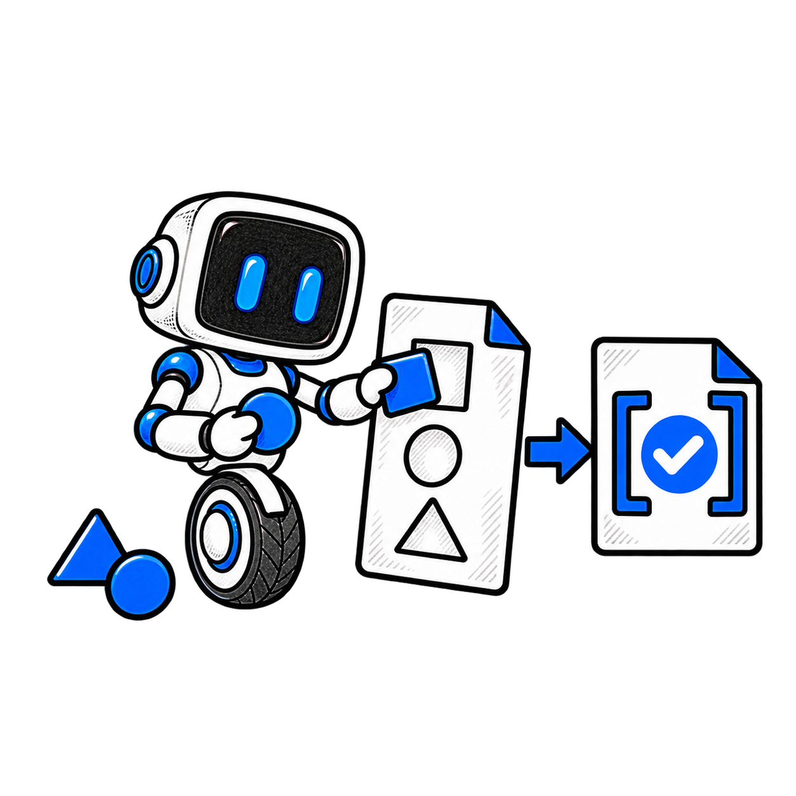
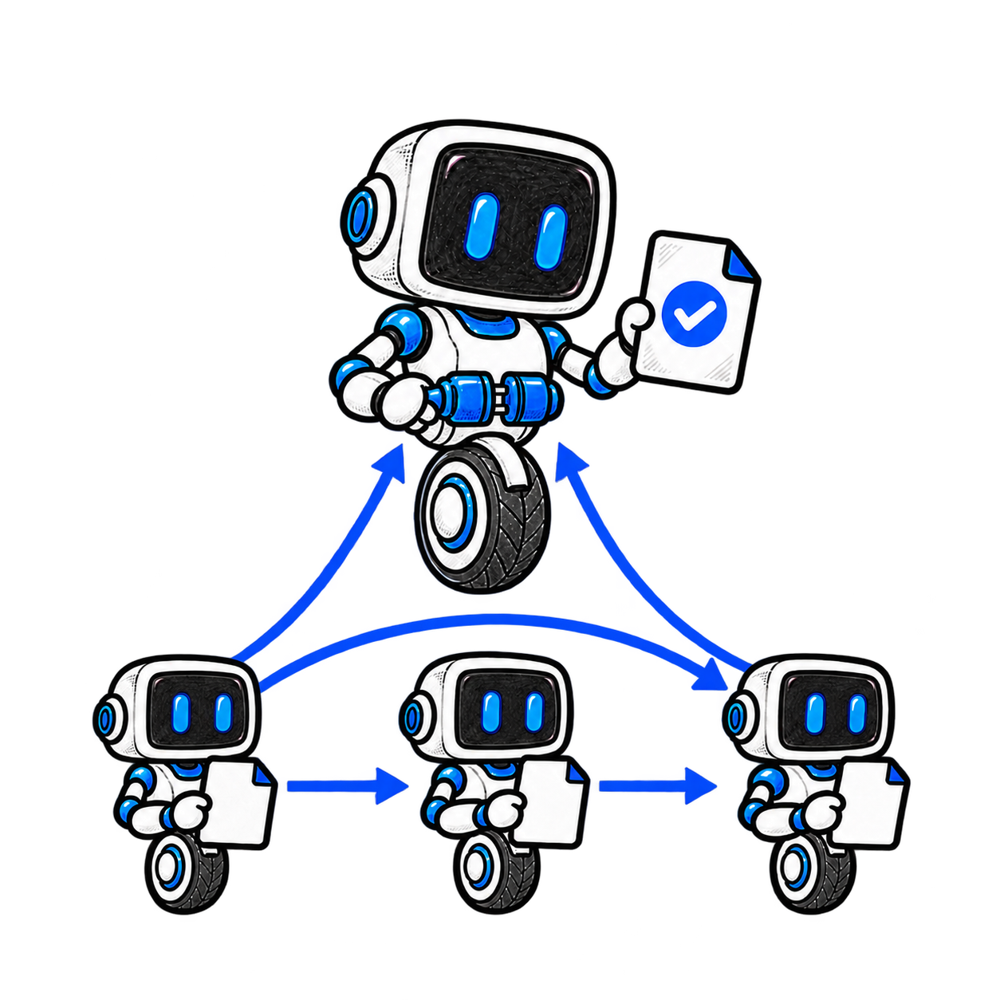
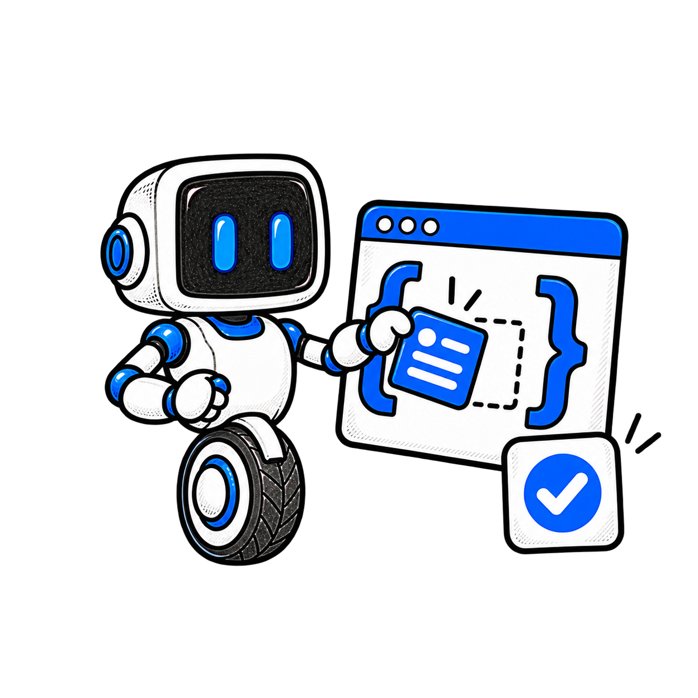
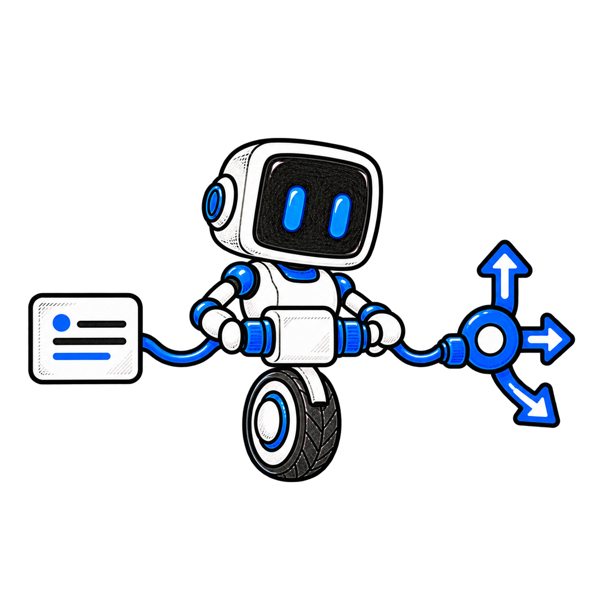
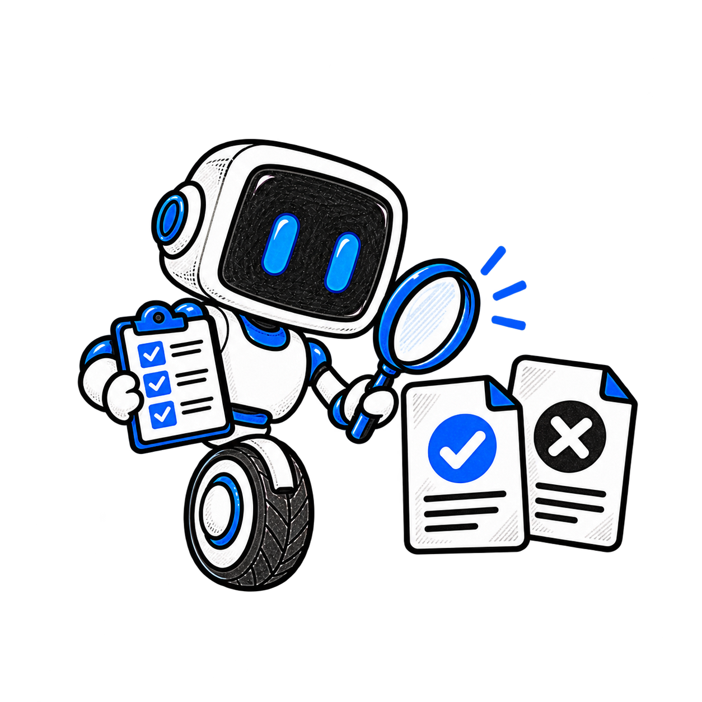
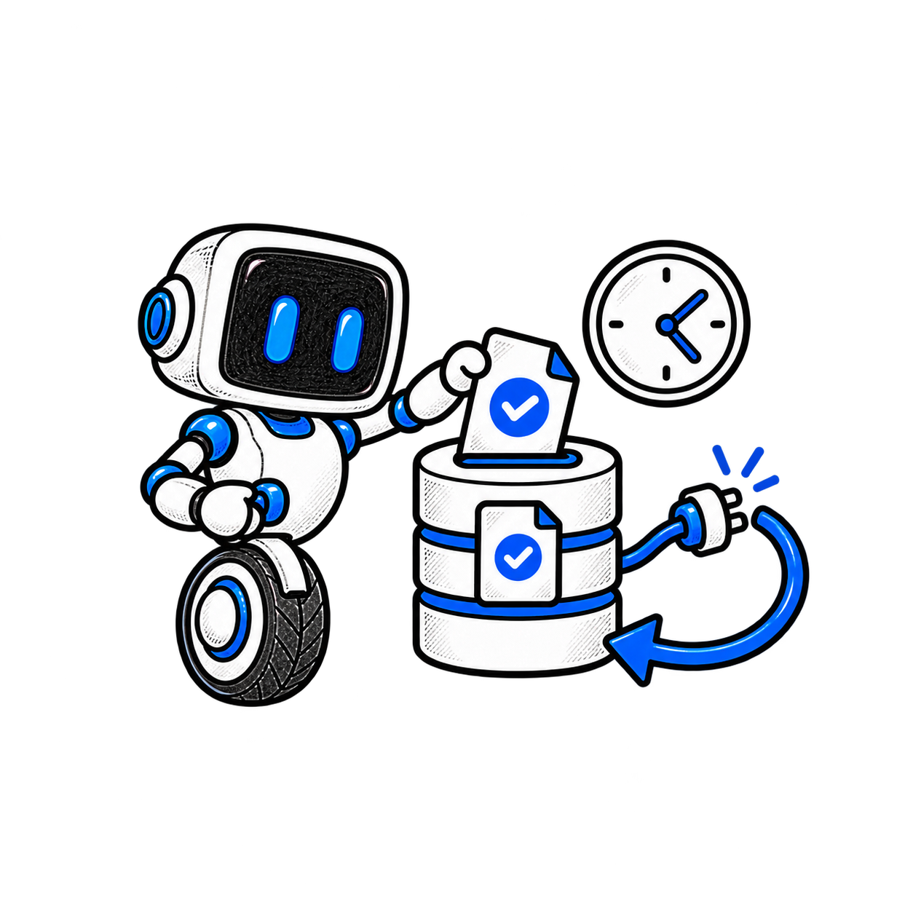
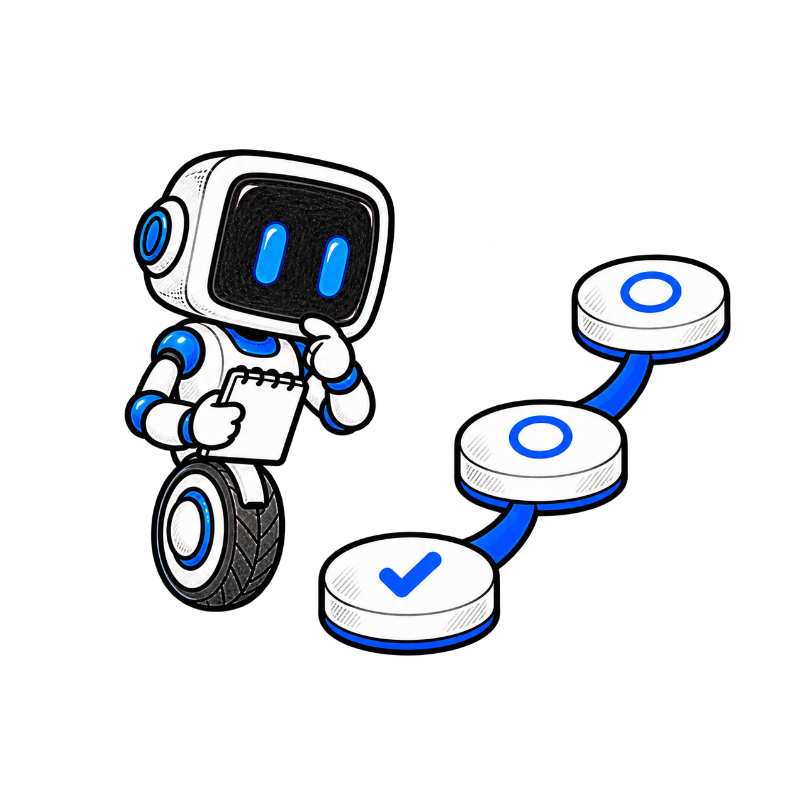

# Guida illustrata al protocollo PACT

**Bozza 0.2.0 · 10 ottobre 2026**

[Scarica il documento Word modificabile](PACT-guida-illustrata.docx)


PACT definisce come agenti costruiti da sviluppatori diversi possano concordare i dati di un incarico, chiedere chiarimenti e consegnare un risultato verificabile. Usa le risorse native di A2A e aggiunge regole esplicite per contratti, domande, eventi e avanzamento.

La bozza 0.2.0 comprende due implementazioni indipendenti, una demo HTTP e prove di recupero dopo un arresto del coordinatore. Questa guida accompagna le undici sezioni della documentazione e spiega cosa è stato realizzato, come usarlo e quali sviluppi restano da affrontare.

## Percorso di lettura

- [1 Il progetto e il suo scopo](#1-il-progetto-e-il-suo-scopo)
- [2 Avviare il primo scambio](#2-avviare-il-primo-scambio)
- [3 Concordare il contratto del task](#3-concordare-il-contratto-del-task)
- [4 Coordinare contributori con dipendenze](#4-coordinare-contributori-con-dipendenze)
- [5 Integrare un chiamante TypeScript](#5-integrare-un-chiamante-typescript)
- [6 Integrare un servizio PHP](#6-integrare-un-servizio-php)
- [7 Collegare il profilo alle rotte Laravel](#7-collegare-il-profilo-alle-rotte-laravel)
- [8 Verificare le regole e gli endpoint](#8-verificare-le-regole-e-gli-endpoint)
- [9 Riprendere il lavoro dopo un arresto](#9-riprendere-il-lavoro-dopo-un-arresto)
- [10 Dichiarare versioni e confini di fiducia](#10-dichiarare-versioni-e-confini-di-fiducia)
- [11 Far crescere la bozza con prove indipendenti](#11-far-crescere-la-bozza-con-prove-indipendenti)

## 1 Il progetto e il suo scopo

Un agente può ricevere un messaggio e restituire una risposta senza che il chiamante sappia quali campi aspettarsi o quando il lavoro sia davvero concluso. PACT rende questo accordo controllabile da entrambi i lati.


*Due agenti possono collaborare se condividono un accordo esplicito sui dati.*

### Un profilo sopra A2A

A2A fornisce la scoperta delle capacità, i messaggi, i task e gli artefatti. PACT usa questi oggetti e inserisce i propri dati nei metadati dell’estensione negoziata. Lo stato nativo del task resta il riferimento per stabilire se il lavoro è in corso, interrotto, fallito o completato.

### Core e Swarm

Core contiene le regole necessarie per un singolo task. Swarm è un’estensione opzionale per coordinare più contributori e dipende da Core. Un agente che supporta solo Core può partecipare a uno scambio singolo; il chiamante attiva Swarm soltanto quando entrambe le parti lo dichiarano.

### La bozza disponibile

La repository contiene specifiche, schemi, SDK TypeScript e PHP, un adapter Laravel, esempi e verifiche eseguibili. PACT è una proposta indipendente. La v0.2 è verificata localmente; documenti e pacchetti attendono la pubblicazione del proprietario della repository.

[Approfondimento tecnico](../../README.md)

## 2 Avviare il primo scambio

La demo mette in comunicazione un chiamante TypeScript e un servizio PHP attraverso HTTP. È deterministica: il risultato dipende dal testo ricevuto e dalle risposte ai chiarimenti.


*La prima demo verifica un task completo senza richiedere un modello AI.*

### Preparare il progetto

Servono Node.js 22 o successivo, PHP 8.2 o successivo e Composer 2. PHP deve includere JSON, mbstring, BCMath, cURL e SQLite. Si installano le dipendenze, si costruiscono le risorse delle SDK e si esegue il setup della reference. I test di arresto del processo usano anche i segnali POSIX su macOS o Linux.

```sh
npm ci --ignore-scripts
npm run build:sdk
composer install --working-dir=sdk/php
composer install --working-dir=reference
php reference/bin/setup.php
```

### Seguire un task

Dalla radice del progetto si avvia il server di sviluppo PHP con php -S 127.0.0.1:8080 -t public reference/router.php. In un altro terminale si esegue la demo Core, che riceve due domande richieste e restituisce cinque parole con approved uguale a true. Qualsiasi server compatibile con PHP può usare public/ come radice web; l’URL viene concordato nella configurazione.

```sh
npm run demo
```

### Eseguire la collaborazione

Per Swarm si avvia il worker in un terminale con php reference/bin/worker.php --watch e si esegue npm run demo:swarm in un altro. Il setup conserva la configurazione esistente e crea token casuali privati nello storage locale escluso da Git.

[Approfondimento tecnico](../../docs/quickstart.md)

## 3 Concordare il contratto del task

Core trasforma l’accordo sui dati in un insieme di regole verificabili. Un contratto identifica gli schemi di input e output e può includere uno schema per le risposte ai chiarimenti.



*Lo schema fissa la forma dei dati e il digest identifica i byte esatti dello schema.*

### Identificare e validare i dati

Ogni descrittore contiene un URI dello schema e il suo SHA 256. Il ricevente risolve soltanto file autorizzati, verifica i byte esatti, la versione dello standard JSON Schema e l’identificatore dichiarato, quindi valida il valore ricevuto. Le SDK usano un registro locale e rifiutano riferimenti esterni agli schemi. Questa validazione controlla la struttura dei dati; l’applicazione deve valutare il contenuto.

### Chiedere chiarimenti insieme

Un task può avere più domande aperte contemporaneamente. Ogni risposta identifica la domanda e lo stesso task e contesto. Un gruppo di risposte viene validato in modo atomico: se una risposta è invalida, nessuna viene salvata. Il task riparte quando tutte le domande richieste che lo bloccano sono risolte. La scadenza di una domanda richiesta provoca il fallimento del task.

### Dimostrare il completamento

Il ricevente deriva il proprio verdetto dai dati degli artefatti e dallo schema concordato. Il completamento richiede un output valido e nessuna domanda richiesta irrisolta. Un codice HTTP positivo o un avanzamento del 100 per cento, da soli, non dimostrano che il risultato soddisfi il contratto.

### Misurare il lavoro corrente

L’avanzamento Core riporta fase, sequenza, unità completate, totale e percentuale. Quando il totale è sconosciuto, anche la percentuale è null. Con un totale noto si controllano i contatori e si arrotonda a due decimali. Un nuovo tentativo può ridurre l’avanzamento corrente; un massimo storico resta una misura distinta.

### Controllare gli eventi

Un evento collega produttore, task, sequenza, tipo, momento e payload. Il suo digest è calcolato sull’intero evento canonico, escluso il solo campo del digest. Il ricevente verifica forma e integrità prima di applicarlo. Il digest rileva alterazioni ma non autentica il produttore: l’identità arriva dal trasporto e dal contesto fidato dell’adapter.

### Gestire duplicati e ritardi

Il replay conserva i byte originariamente accettati. Lo stesso identificatore con byte diversi produce un conflitto, anche se il JSON ha lo stesso significato. Eventi validi ma vecchi restano registrati senza sovrascrivere lo stato più recente. Gli stati terminali restano immutabili e gli errori espongono un codice, un messaggio sicuro e l’indicazione di ritentabilità.

### Separare consegna e risultato

Una notifica viene riconosciuta dopo il commit della ricevuta e dello stato. Errori di connessione e alcuni errori HTTP possono richiedere una nuova consegna con gli stessi byte. L’esaurimento dei tentativi viene registrato come problema di consegna; non viene convertito in successo del task.

[Approfondimento tecnico](../../specification/PACT-CORE-v0.2.md)

## 4 Coordinare contributori con dipendenze

Swarm organizza un task padre e un grafo aciclico di contributori. Un coordinatore autenticato conserva il piano, assegna i task figli e raccoglie gli output necessari al risultato finale.



*Ogni contributore parte quando dispone degli output validati dei propri predecessori.*

### Usare dati prodotti davvero

La demo esegue extract, review e assemble su tre endpoint HTTP. Review riceve il dato validato di extract; assemble riceve quelli di entrambi. Un audit opzionale può fallire senza bloccare il lavoro richiesto. Il primo tentativo di review può fallire, mentre il secondo crea un nuovo task e conserva la storia del precedente.

### Misurare lo sforzo

Nella demo i contributori richiesti pesano 1, 2 e 1. Le fasi di esecuzione, aggregazione e validazione pesano 80, 10 e 10. Il calcolo usa l’espressione razionale completa e arrotonda soltanto alla fine. Il lavoro opzionale resta visibile fuori dal calcolo richiesto. Il massimo storico viene conservato se un retry riduce la percentuale corrente.

### Conservare provenienza e controllo

La provenienza registra task reali, tentativi, stati, artefatti e digest dei dati. Il padre valida anche l’output assemblato. La cancellazione registra prima l’intenzione e poi le osservazioni dei figli: il comando del padre non dimostra che ogni agente remoto si sia fermato. Il profilo definisce anche quorum, mentre la reference esegue soltanto la politica all_required.

[Approfondimento tecnico](../../specification/PACT-SWARM-v0.2.md)

## 5 Integrare un chiamante TypeScript

La SDK TypeScript offre le regole del profilo e un client HTTP. Consente di costruire uno scambio PACT senza copiare la logica della reference PHP.



*Il chiamante verifica autonomamente ciò che riceve dal servizio remoto.*

### Un nucleo utilizzabile

La classe Pact controlla risorse, contratti, risposte, transizioni, grafi e avanzamento. La SDK include gli schemi della propria versione e un’implementazione della canonicalizzazione e dei digest. L’avanzamento pesato usa aritmetica razionale con BigInt, così il risultato non dipende da arrotondamenti intermedi.

### Verificare lo scambio HTTP

PactClient gestisce lo scambio del binding JSON RPC usato dal progetto. Controlla l’attivazione delle estensioni, il contratto e gli artefatti ricevuti. Quando il task dichiara di essere completato, il client valida i dati dell’output contro il registro locale concordato. La fiducia nel servizio non sostituisce questo controllo.

### Adottare il pacchetto

La build produce codice e tipi per Node.js 22 o successivo. L’archivio npm è stato installato e importato in un’applicazione temporanea esterna al checkout. Il pacchetto è pronto come archivio locale; la pubblicazione sul registro resta un’attività di release. La SDK non fornisce da sola un database o un coordinatore durabile.

[Approfondimento tecnico](../../sdk/typescript/README.md)

## 6 Integrare un servizio PHP

La SDK PHP implementa Core e Swarm senza dipendere da Laravel. Un’applicazione PHP può usarla per validare i dati e applicare le regole del profilo nel proprio servizio.


*La seconda implementazione esegue le stesse regole in modo indipendente.*

### Regole indipendenti

Pact esegue controlli di forma e di comportamento, valida i contratti registrati e calcola eventi e avanzamento. PHP usa Opis per JSON Schema e BCMath per l’aritmetica esatta dello Swarm. La canonicalizzazione è implementata nella SDK e viene confrontata con i risultati attesi degli stessi vettori portabili usati da TypeScript.

### Un client essenziale

Il client PHP consegna comandi HTTP e controlla i task ottenuti, incluse le prove di output completato. È usato dal worker della reference per parlare con i contributori. La superficie pubblica del client è essenziale e non espone ogni comodità del client TypeScript.

### Installazione e responsabilità

Il pacchetto richiede PHP 8.2 o successivo e le estensioni dichiarate in Composer. L’archivio include risorse e licenza ed è stato provato in un’applicazione separata. Autenticazione, persistenza e consegna atomica restano responsabilità dell’applicazione che integra la SDK. La pubblicazione del pacchetto Composer è ancora da eseguire.

[Approfondimento tecnico](../../sdk/php/README.md)

## 7 Collegare il profilo alle rotte Laravel

L’adapter Laravel collega un servizio che implementa il binding PACT al router del framework. La logica di protocollo resta nel nucleo PHP, che può essere usato anche in altre applicazioni.



*L’adapter traduce il confine HTTP lasciando le regole nella SDK Core.*

### Un confine piccolo

Routes registra le rotte del binding e passa al servizio metodo, percorso, header e corpo della richiesta. La risposta mantiene il codice HTTP, gli header di attivazione e il corpo del binding. Questa separazione consente di testare le regole del profilo senza costruire un’applicazione Laravel completa.

### Un uso reale nella reference

Il servizio locale usa il router Illuminate 12 per lo scambio delle demo e delle prove HTTP. Nel documento l’adapter rappresenta un’integrazione verificata sul binding dichiarato: non implica il supporto di tutte le modalità di trasporto e notifica di A2A.

### Definire l’identità sul server

L’applicazione stabilisce l’identità autenticata, il tenant e i diritti di delega. I metadati pubblici di un messaggio non possono concedere queste autorizzazioni. La reference usa token configurati localmente; un’installazione operativa deve definire la propria gestione delle credenziali e dei confini di accesso.

[Approfondimento tecnico](../../sdk/laravel/README.md)

## 8 Verificare le regole e gli endpoint

La conformità del profilo viene verificata su due livelli: casi portabili con risultati attesi e scambi reali attraverso HTTP. L’accordo tra due SDK, da solo, potrebbe nascondere lo stesso errore in entrambe.



*Un controllo utile confronta i risultati con aspettative esplicite e prova anche i rifiuti.*

### Confrontare valori ed errori

I 147 vettori condivisi vengono eseguiti indipendentemente da TypeScript e PHP. Entrambe le implementazioni devono produrre il valore o il codice di errore dichiarato. I casi coprono digest, Unicode, schemi, domande concorrenti, transizioni, grafi e calcoli pesati. Il corpus storico v0.1 conserva i suoi 88 controlli separati.

### Provare un servizio vero

La CLI scopre l’Agent Card e controlla attivazione, contratto, output, replay e stati terminali. La suite della reference verifica anche autenticazione, isolamento dei tenant, risposte atomiche, scadenze, cancellazione ed eventi fuori ordine. Un peer costruito appositamente con output invalido viene rifiutato e la CLI termina con errore.

### Leggere la prova nel suo ambito

Al 9 ottobre 2026 risultano passati 178 test Node, 11 test HTTP e 14 controlli live sul servizio di riferimento. Sono stati verificati anche tre archivi di pacchetto separati. Queste prove riguardano il profilo e il binding dichiarati. Non certificano ogni funzione A2A, la verità del contenuto prodotto o l’operatività in produzione.

[Approfondimento tecnico](../../conformance/v0.2/README.md)

## 9 Riprendere il lavoro dopo un arresto

Una risposta persa non permette di sapere se il servizio remoto abbia eseguito il comando. La reference conserva abbastanza informazioni per riconciliare quel caso senza inventare un nuovo task.



*Il recupero ritrova il comando accettato e conserva un solo effetto registrato.*

### Salvare prima di consegnare

SQLite registra task, domande, ricevute e notifiche pendenti nella stessa transazione. La outbox conserva i byte serializzati, il numero di tentativi e la prossima consegna. Una chiave di idempotenza lega il comando al task accettato nel contesto autenticato di tenant e chiamante.

### Proteggere il worker corrente

Il worker acquisisce una lease di sei secondi e usa un timeout HTTP di cinque. Ritenta gli errori ammessi fino a cinque consegne con attesa esponenziale e jitter. Un worker con una lease sostituita non può confermare il risultato o far fallire il lavoro del successore. La cancellazione dopo una ricevuta persa continua a riconciliare il figlio già accettato.

### Provare un recupero concreto

Il test arresta davvero il processo con SIGKILL dopo il commit del figlio remoto e prima della conferma locale. Riavvia il worker sullo stesso database e controlla task originale, comando identico ed effetto registrato una sola volta. Un secondo caso chiude la connessione dopo il commit. Il test dimostra deduplicazione nella reference; il failover distribuito resta da realizzare.

[Approfondimento tecnico](../../docs/implementation.md)

## 10 Dichiarare versioni e confini di fiducia

Due agenti devono concordare la stessa versione, lo stesso contratto e le estensioni necessarie. Il semplice fatto che entrambi parlino HTTP non basta a garantire uno scambio PACT.


*Le capacità vengono dichiarate e attivate prima di interpretare i dati vincolati.*

### Un binding dichiarato

La v0.2 usa il binding JSON RPC A2A 1.0, con SendMessage, GetTask e CancelTask. La richiesta invia A2A-Version e le estensioni da attivare; la risposta conferma quelle effettivamente attivate. Core è richiesto nella reference e Swarm è opzionale. Un downgrade deve essere autorizzato dal chiamante.

### Proteggere il contesto

L’identità del produttore e il tenant arrivano dall’autenticazione gestita dal server. Il registro degli schemi limita i file ammessi e ne controlla i digest. Un hash integro non concede un’autorizzazione e uno schema valido non dimostra che un’affermazione sia vera. HTTPS, conservazione dei dati e politiche operative spettano all’applicazione.

### Conservare la storia del progetto

La proposta originale v0.1 e lo schema progress fornito restano invariati. La nuova bozza usa identificatori nel namespace della repository del proprietario e attende la pubblicazione. Streaming, altri binding A2A e passaggio di proprietà tra coordinatori non sono verificati da questa reference.

[Approfondimento tecnico](../../docs/compatibility.md)

## 11 Far crescere la bozza con prove indipendenti

La v0.2 offre una base locale implementata e verificata. Il passo successivo più utile è osservare come un altro sviluppatore interpreta la specifica senza riusare le nostre implementazioni.



*Le prossime tappe distinguono nuove prove di interoperabilità dalla pubblicazione.*

### Validare una terza implementazione

Una nuova implementazione costruita dalla sola specifica può rivelare ambiguità che TypeScript e PHP condividono. Deve consumare i vettori portabili e poi partecipare a uno scambio live. Le discrepanze devono diventare casi riproducibili o chiarimenti della specifica.

### Estendere coordinamento e trasporto

Il lavoro successivo comprende worker concorrenti, trasferimento del coordinamento, quorum eseguibile e piani annidati. Streaming e configurazione delle notifiche push A2A richiedono adapter e prove dedicate. L’avanzamento deve continuare a distinguere il lavoro corrente, il massimo storico e la validità del risultato.

### Preparare una release

Prima di pubblicare si riesaminano specifiche, dipendenze, licenze e canali privati di segnalazione. Il proprietario decide push, tag e pubblicazione dei documenti e dei pacchetti. La repository mantiene la licenza MIT; la proposta originale di Apache 2.0 resta una decisione di governance aperta.

[Approfondimento tecnico](../../docs/roadmap.md)

## Glossario e riferimenti

| Termine | Significato |
| --- | --- |
| Task | Incarico con identità, contesto e stato nativo A2A. |
| Artefatto | Dato di output che il ricevente valida contro il contratto. |
| Digest | Impronta dei byte o dei dati canonici; non è una firma. |
| Outbox | Registro durabile dei comandi e delle notifiche da consegnare. |
| Lease | Possesso temporaneo di un lavoro, rinnovabile o sostituibile. |
| Tenant | Contesto di accesso e isolamento assegnato dall’applicazione. |
| High watermark | Massimo storico della percentuale nella stessa generazione. |

I riferimenti seguenti appartengono al checkout della bozza. La specifica resta il riferimento per implementare il profilo; la guida ne spiega il percorso e l’uso.

- [Specifica Core](../../specification/PACT-CORE-v0.2.md)
- [Specifica Swarm](../../specification/PACT-SWARM-v0.2.md)
- [Avvio e demo](../../docs/quickstart.md)
- [Persistenza e recupero](../../docs/implementation.md)
- [Audit delle verifiche locali](../../docs/delivery-plan.md)
- [Compatibilità](../../docs/compatibility.md)
- [Governance e licenza](../../GOVERNANCE.md)
- [Politica di sicurezza](../../SECURITY.md)
- [Contributi](../../CONTRIBUTING.md)

Le illustrazioni sono disponibili come PNG con trasparenza reale. [Il catalogo dei prompt](art-direction.json) registra il sistema visivo e la revisione del grafo Swarm.
